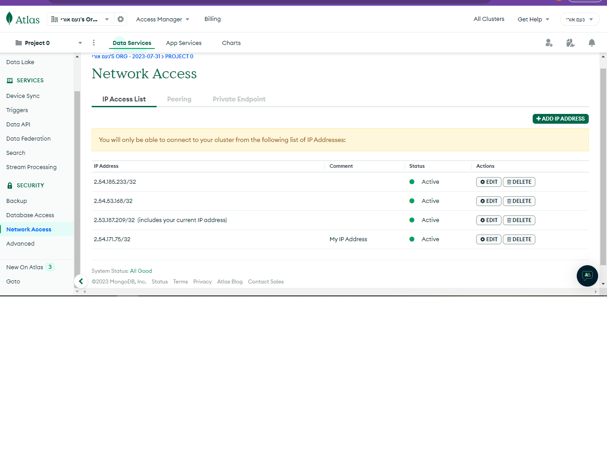

# Mongo
**important**: if you run the server local, you must include your external ip to connect to mongodb. 
u should go to Atlas mongodb web, sign in with noams credentials, and u supuse to find a bottun that will add your ip.

